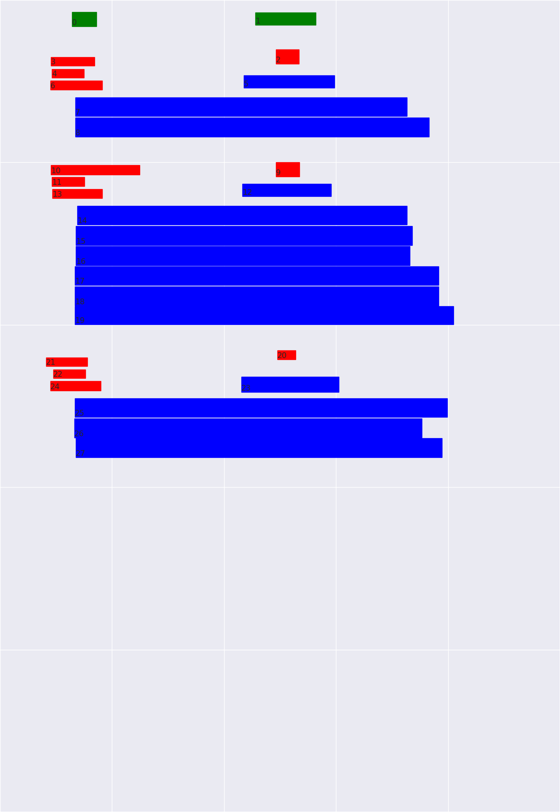
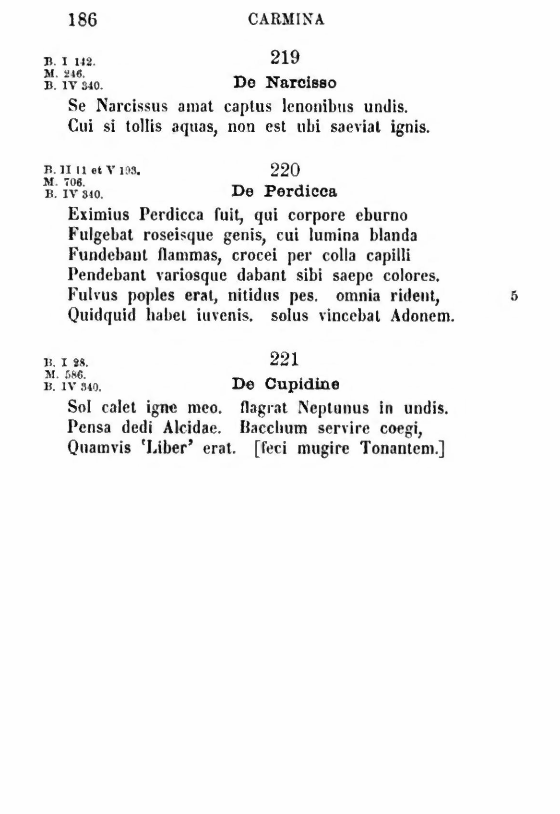

# anthologia-latina-hocr-to-tei

## Install and run

On python3.6

```shell
pip install -r requirements.txt
python convert.py
```

## Example output



## Example image input




## Example hOCR input0182

```html
<!DOCTYPE html>
<html>
	<head>
		<meta http-equiv="Content-Type" content="text/html; charset=utf-8"/>
		<meta name="ocr-system" content="kraken"/>
		<meta name="ocr-capabilities" content="ocr_page ocr_line ocrx_word"/>
	</head>
	<body>
		<div class="ocr_page" title="bbox 0 0 1167 1692; image /tmp/tmpltx0xd27" style="writing-mode: horizontal-tb;">
			<span class="ocr_line" id="line_0" title="bbox 150 25 201 55; x_bboxes 150 25 155 55 176 25 176 55 196 25 201 55">
				<span class="ocrx_word" id="segment_0" title="bbox 150 25 201 55; x_confs 0.9999975 0.99999213 0.9905032">186</span>
			</span>
			<br/>
			<span class="ocr_line" id="line_1" title="bbox 106 119 197 137; x_bboxes 106 119 106 137 113 119 116 137 119 119 126 137 135 119 139 137 142 119 152 137 161 119 164 137 190 119 190 137 197 119 197 137">
				<span class="ocrx_word" id="segment_1" title="bbox 106 119 116 137; x_confs 0.99936384 0.99930274">B.</span>
				<span class="ocrx_word" id="segment_2" title="bbox 119 119 126 137; x_confs 0.9999937"> </span>
				<span class="ocrx_word" id="segment_3" title="bbox 135 119 139 137; x_confs 0.9999807">I</span>
				<span class="ocrx_word" id="segment_4" title="bbox 142 119 152 137; x_confs 0.9999908"> </span>
				<span class="ocrx_word" id="segment_5" title="bbox 161 119 197 137; x_confs 0.9985838 0.97293144 0.99954504">12.</span>
			</span>
			<br/>
			<span class="ocr_line" id="line_2" title="bbox 108 144 175 162; x_bboxes 108 144 111 162 117 144 120 162 123 144 129 162 142 144 142 162 154 144 154 162 169 144 169 162 175 144 175 162">
				<span class="ocrx_word" id="segment_6" title="bbox 108 144 120 162; x_confs 0.9995536 0.99948645">M.</span>
				<span class="ocrx_word" id="segment_7" title="bbox 123 144 129 162; x_confs 0.9997284"> </span>
				<span class="ocrx_word" id="segment_8" title="bbox 142 144 175 162; x_confs 0.99922526 0.99937904 0.62240446 0.9887271">246.</span>
			</span>
			<br/>
			<span class="ocr_line" id="line_3" title="bbox 105 168 213 187; x_bboxes 105 168 108 187 115 168 115 187 118 168 125 187 135 168 138 187 155 168 159 187 162 168 166 187 179 168 179 187 193 168 193 187 203 168 206 187 213 168 213 187">
				<span class="ocrx_word" id="segment_9" title="bbox 105 168 115 187; x_confs 0.998485 0.99935">B.</span>
				<span class="ocrx_word" id="segment_10" title="bbox 118 168 125 187; x_confs 0.99975663"> </span>
				<span class="ocrx_word" id="segment_11" title="bbox 135 168 159 187; x_confs 0.9999993 0.9999614">IV</span>
				<span class="ocrx_word" id="segment_12" title="bbox 162 168 166 187; x_confs 0.99917465"> </span>
				<span class="ocrx_word" id="segment_13" title="bbox 179 168 213 187; x_confs 0.9992188 0.7565827 0.9848645 0.96862864">340.</span>
			</span>
			<br/>
			<span class="ocr_line" id="line_4" title="bbox 532 26 658 52; x_bboxes 532 26 536 52 541 26 541 52 581 26 581 52 608 26 608 52 622 26 622 52 644 26 649 52 658 26 658 52">
				<span class="ocrx_word" id="segment_14" title="bbox 532 26 658 52; x_confs 0.99985886 0.9996196 0.996637 0.9999771 0.996172 0.9953752 0.9813508">CARMINA</span>
			</span>
			<br/>
			<span class="ocr_line" id="line_5" title="bbox 575 103 623 133; x_bboxes 575 103 581 133 597 103 597 133 618 103 623 133">
				<span class="ocrx_word" id="segment_15" title="bbox 575 103 623 133; x_confs 0.9999989 0.9999906 0.99595344">219</span>
			</span>
			<br/>
			<span class="ocr_line" id="line_6" title="bbox 508 157 697 183; x_bboxes 508 157 508 183 524 157 527 183 535 157 547 183 578 157 578 183 585 157 589 183 616 157 616 183 632 157 632 183 643 157 643 183 659 157 662 183 678 157 678 183 697 157 697 183">
				<span class="ocrx_word" id="segment_16" title="bbox 508 157 527 183; x_confs 0.99384695 0.9998884">De</span>
				<span class="ocrx_word" id="segment_17" title="bbox 535 157 547 183; x_confs 0.9999331"> </span>
				<span class="ocrx_word" id="segment_18" title="bbox 578 157 697 183; x_confs 1.0 0.99999034 0.570157 0.9781043 0.99495304 0.9999049 0.9981159 0.99789196">Narcisso</span>
			</span>
			<br/>
			<span class="ocr_line" id="line_7" title="bbox 157 203 848 242; x_bboxes 157 203 157 242 173 203 173 242 184 203 196 242 219 203 219 242 230 203 230 242 253 203 253 242 269 203 269 242 280 203 280 242 292 203 295 242 307 203 311 242 318 203 322 242 342 203 345 242 353 203 365 242 372 203 376 242 391 203 395 242 418 203 422 242 437 203 437 242 449 203 460 242 476 203 480 242 487 203 487 242 503 203 507 242 526 203 526 242 537 203 537 242 560 203 564 242 572 203 583 242 591 203 595 242 606 203 610 242 622 203 622 242 645 203 648 242 656 203 660 242 675 203 679 242 687 203 691 242 706 203 710 242 733 203 733 242 741 203 752 242 764 203 764 242 783 203 787 242 810 203 813 242 821 203 821 242 836 203 836 242 848 203 848 242">
				<span class="ocrx_word" id="segment_19" title="bbox 157 203 173 242; x_confs 0.99993 0.9103198">Se</span>
				<span class="ocrx_word" id="segment_20" title="bbox 184 203 196 242; x_confs 0.9999838"> </span>
				<span class="ocrx_word" id="segment_21" title="bbox 219 203 345 242; x_confs 0.71329594 0.9989489 0.9999999 0.9999999 0.9927471 1.0 0.9999999 0.99999976 1.0">Narcissus</span>
				<span class="ocrx_word" id="segment_22" title="bbox 353 203 365 242; x_confs 1.0"> </span>
				<span class="ocrx_word" id="segment_23" title="bbox 372 203 437 242; x_confs 0.9999999 1.0 1.0 0.9999999">amat</span>
				<span class="ocrx_word" id="segment_24" title="bbox 449 203 460 242; x_confs 1.0"> </span>
				<span class="ocrx_word" id="segment_25" title="bbox 476 203 564 242; x_confs 0.99999976 0.99999964 0.999995 1.0 0.9999964 0.7835385">captus</span>
				<span class="ocrx_word" id="segment_26" title="bbox 572 203 583 242; x_confs 0.9999186"> </span>
				<span class="ocrx_word" id="segment_27" title="bbox 591 203 733 242; x_confs 0.9999248 0.99996936 0.98186344 0.9999733 0.9878835 0.999892 0.9995584 0.9998679 0.88932955">lenonibus</span>
				<span class="ocrx_word" id="segment_28" title="bbox 741 203 752 242; x_confs 0.9964478"> </span>
				<span class="ocrx_word" id="segment_29" title="bbox 764 203 848 242; x_confs 0.9959883 0.9999908 0.9999876 0.99992955 0.9996284 0.999982">undis.</span>
			</span>
			<br/>
			<span class="ocr_line" id="line_8" title="bbox 157 245 894 285; x_bboxes 157 245 161 285 169 245 169 285 189 245 189 285 201 245 209 285 225 245 225 285 233 245 237 285 245 245 257 285 265 245 269 285 285 245 285 285 297 245 297 285 305 245 309 285 317 245 317 285 333 245 333 285 341 245 353 285 361 245 361 285 389 245 389 285 401 245 401 285 417 245 417 285 441 245 441 285 445 245 449 285 457 245 469 285 481 245 481 285 505 245 505 285 517 245 517 285 538 245 550 285 562 245 566 285 578 245 582 285 590 245 594 285 602 245 614 285 622 245 626 285 642 245 646 285 662 245 662 285 674 245 682 285 698 245 702 285 706 245 710 285 730 245 734 285 750 245 750 285 758 245 762 285 770 245 770 285 786 245 790 285 798 245 810 285 818 245 822 285 830 245 834 285 850 245 850 285 866 245 870 285 882 245 886 285 894 245 894 285">
				<span class="ocrx_word" id="segment_30" title="bbox 157 245 189 285; x_confs 0.99999976 0.9999989 0.9999982">Cui</span>
				<span class="ocrx_word" id="segment_31" title="bbox 201 245 209 285; x_confs 0.99999976"> </span>
				<span class="ocrx_word" id="segment_32" title="bbox 225 245 237 285; x_confs 0.9974831 1.0">si</span>
				<span class="ocrx_word" id="segment_33" title="bbox 245 245 257 285; x_confs 0.9999951"> </span>
				<span class="ocrx_word" id="segment_34" title="bbox 265 245 333 285; x_confs 0.99999976 0.99159133 0.9999999 1.0 0.97811365 0.9999999">tollis</span>
				<span class="ocrx_word" id="segment_35" title="bbox 341 245 353 285; x_confs 1.0"> </span>
				<span class="ocrx_word" id="segment_36" title="bbox 361 245 449 285; x_confs 0.99982315 1.0 0.9999925 0.9999999 0.99999845 0.9999999">aquas,</span>
				<span class="ocrx_word" id="segment_37" title="bbox 457 245 469 285; x_confs 1.0"> </span>
				<span class="ocrx_word" id="segment_38" title="bbox 481 245 517 285; x_confs 0.99978584 0.99999726 0.99999976">non</span>
				<span class="ocrx_word" id="segment_39" title="bbox 538 245 550 285; x_confs 0.99999976"> </span>
				<span class="ocrx_word" id="segment_40" title="bbox 562 245 594 285; x_confs 0.99970764 0.9134281 0.9999788">est</span>
				<span class="ocrx_word" id="segment_41" title="bbox 602 245 614 285; x_confs 0.999948"> </span>
				<span class="ocrx_word" id="segment_42" title="bbox 622 245 662 285; x_confs 0.9999646 0.99929786 0.9999769">ubi</span>
				<span class="ocrx_word" id="segment_43" title="bbox 674 245 682 285; x_confs 0.9984339"> </span>
				<span class="ocrx_word" id="segment_44" title="bbox 698 245 790 285; x_confs 0.999821 0.90403515 0.99977165 0.99995804 0.99999213 0.99985886 0.99971074">saeviat</span>
				<span class="ocrx_word" id="segment_45" title="bbox 798 245 810 285; x_confs 0.9995634"> </span>
				<span class="ocrx_word" id="segment_46" title="bbox 818 245 894 285; x_confs 0.9998423 0.9999838 0.9999527 0.99850625 0.9998217 0.9938763">ignis.</span>
			</span>
			<br/>
			<span class="ocr_line" id="line_9" title="bbox 106 344 291 364; x_bboxes 106 344 106 364 112 344 115 364 118 344 118 364 130 344 133 364 146 344 146 364 152 344 155 364 164 344 164 364 176 344 179 364 182 344 188 364 197 344 200 364 209 344 209 364 218 344 218 364 236 344 239 364 242 344 246 364 270 344 270 364 282 344 282 364 291 344 291 364">
				<span class="ocrx_word" id="segment_47" title="bbox 106 344 115 364; x_confs 0.9999653 0.99986625">B.</span>
				<span class="ocrx_word" id="segment_48" title="bbox 118 344 118 364; x_confs 0.9997093"> </span>
				<span class="ocrx_word" id="segment_49" title="bbox 130 344 146 364; x_confs 0.9999913 0.99533147">II</span>
				<span class="ocrx_word" id="segment_50" title="bbox 152 344 155 364; x_confs 0.99999475"> </span>
				<span class="ocrx_word" id="segment_51" title="bbox 164 344 179 364; x_confs 0.50734764 0.9999442">1I</span>
				<span class="ocrx_word" id="segment_52" title="bbox 182 344 188 364; x_confs 0.9998338"> </span>
				<span class="ocrx_word" id="segment_53" title="bbox 197 344 209 364; x_confs 0.99999905 0.9999386">et</span>
				<span class="ocrx_word" id="segment_54" title="bbox 218 344 218 364; x_confs 0.99771726"> </span>
				<span class="ocrx_word" id="segment_55" title="bbox 236 344 239 364; x_confs 0.98899347">V</span>
				<span class="ocrx_word" id="segment_56" title="bbox 242 344 246 364; x_confs 0.9964826"> </span>
				<span class="ocrx_word" id="segment_57" title="bbox 270 344 291 364; x_confs 0.7385894 0.3945866 0.92517656">93.</span>
			</span>
			<br/>
			<span class="ocr_line" id="line_10" title="bbox 108 369 176 388; x_bboxes 108 369 112 388 118 369 118 388 121 369 128 388 141 369 141 388 153 369 157 388 169 369 169 388 176 369 176 388">
				<span class="ocrx_word" id="segment_58" title="bbox 108 369 118 388; x_confs 0.95646244 0.99963176">M.</span>
				<span class="ocrx_word" id="segment_59" title="bbox 121 369 128 388; x_confs 0.99999857"> </span>
				<span class="ocrx_word" id="segment_60" title="bbox 141 369 176 388; x_confs 0.999046 0.99885035 0.9487083 0.9945733">706.</span>
			</span>
			<br/>
			<span class="ocr_line" id="line_11" title="bbox 109 394 213 413; x_bboxes 109 394 109 413 116 394 116 413 119 394 126 413 138 394 142 413 158 394 161 413 164 394 168 413 180 394 180 413 193 394 193 413 206 394 206 413 213 394 213 413">
				<span class="ocrx_word" id="segment_61" title="bbox 109 394 116 413; x_confs 0.99876726 0.9997652">B.</span>
				<span class="ocrx_word" id="segment_62" title="bbox 119 394 126 413; x_confs 0.999127"> </span>
				<span class="ocrx_word" id="segment_63" title="bbox 138 394 161 413; x_confs 0.99999094 0.99999785">IV</span>
				<span class="ocrx_word" id="segment_64" title="bbox 164 394 168 413; x_confs 0.99192303"> </span>
				<span class="ocrx_word" id="segment_65" title="bbox 180 394 213 413; x_confs 0.9998288 0.7456164 0.91373587 0.99457425">310.</span>
			</span>
			<br/>
			<span class="ocr_line" id="line_12" title="bbox 575 338 624 368; x_bboxes 575 338 575 368 597 338 597 368 618 338 624 368">
				<span class="ocrx_word" id="segment_66" title="bbox 575 338 624 368; x_confs 0.99995995 0.99999905 0.9978059">220</span>
			</span>
			<br/>
			<span class="ocr_line" id="line_13" title="bbox 505 383 690 409; x_bboxes 505 383 505 409 521 383 524 409 532 383 544 409 571 383 571 409 586 383 590 409 609 383 609 409 629 383 629 409 640 383 644 409 660 383 660 409 679 383 679 409 690 383 690 409">
				<span class="ocrx_word" id="segment_67" title="bbox 505 383 524 409; x_confs 0.9982627 0.9999074">De</span>
				<span class="ocrx_word" id="segment_68" title="bbox 532 383 544 409; x_confs 0.9999869"> </span>
				<span class="ocrx_word" id="segment_69" title="bbox 571 383 690 409; x_confs 1.0 0.999992 1.0 0.99959534 0.999764 0.99992657 0.85956156 0.98811996">Perdicca</span>
			</span>
			<br/>
			<span class="ocr_line" id="line_14" title="bbox 161 429 848 468; x_bboxes 161 429 161 468 177 429 177 468 189 429 189 468 201 429 201 468 229 429 229 468 241 429 241 468 262 429 266 468 278 429 286 468 306 429 306 468 322 429 326 468 338 429 342 468 358 429 362 468 370 429 370 468 386 429 386 468 402 429 406 468 414 429 414 468 430 429 442 468 454 429 454 468 462 429 466 468 482 429 482 468 495 429 495 468 503 429 503 468 515 429 527 468 543 429 547 468 555 429 559 468 575 429 575 468 587 429 599 468 611 429 615 468 631 429 631 468 647 429 647 468 655 429 659 468 683 429 683 468 699 429 699 468 715 429 719 468 727 429 739 468 752 429 756 468 764 429 768 468 784 429 788 468 808 429 812 468 820 429 820 468 844 429 848 468">
				<span class="ocrx_word" id="segment_70" title="bbox 161 429 266 468; x_confs 0.9999999 0.9999989 0.9993445 0.9999982 0.9999994 0.65796137 0.9999999">Eximius</span>
				<span class="ocrx_word" id="segment_71" title="bbox 278 429 286 468; x_confs 1.0"> </span>
				<span class="ocrx_word" id="segment_72" title="bbox 306 429 414 468; x_confs 0.9999999 0.999998 0.99999464 1.0 0.71964145 0.9999994 1.0 0.999739">Perdicca</span>
				<span class="ocrx_word" id="segment_73" title="bbox 430 429 442 468; x_confs 1.0"> </span>
				<span class="ocrx_word" id="segment_74" title="bbox 454 429 503 468; x_confs 0.9999988 1.0 0.99999774 0.99999976 0.99999607">fuit,</span>
				<span class="ocrx_word" id="segment_75" title="bbox 515 429 527 468; x_confs 1.0"> </span>
				<span class="ocrx_word" id="segment_76" title="bbox 543 429 575 468; x_confs 0.9999999 1.0 0.9968701">qui</span>
				<span class="ocrx_word" id="segment_77" title="bbox 587 429 599 468; x_confs 0.9999416"> </span>
				<span class="ocrx_word" id="segment_78" title="bbox 611 429 719 468; x_confs 0.9999721 0.9999503 0.99995685 0.9997825 0.9999157 0.99992394 0.9999796">corpore</span>
				<span class="ocrx_word" id="segment_79" title="bbox 727 429 739 468; x_confs 0.99997616"> </span>
				<span class="ocrx_word" id="segment_80" title="bbox 752 429 848 468; x_confs 0.999892 0.9999497 0.99998915 0.99999106 0.94319683 0.99761945">eburno</span>
			</span>
			<br/>
			<span class="ocr_line" id="line_15" title="bbox 158 471 859 511; x_bboxes 158 471 158 511 170 471 170 511 190 471 190 511 198 471 202 511 222 471 226 511 234 471 234 511 250 471 254 511 270 471 274 511 282 471 294 511 306 471 310 511 326 471 326 511 342 471 342 511 358 471 358 511 366 471 370 511 382 471 386 511 402 471 402 511 414 471 414 511 438 471 438 511 450 471 458 511 470 471 474 511 494 471 494 511 507 471 507 511 527 471 527 511 543 471 543 511 547 471 551 511 559 471 571 511 587 471 587 511 599 471 599 511 619 471 619 511 627 471 639 511 647 471 651 511 659 471 659 511 679 471 683 511 707 471 707 511 719 471 719 511 735 471 739 511 755 471 763 511 775 471 775 511 795 471 795 511 803 471 803 511 823 471 823 511 847 471 851 511 859 471 859 511">
				<span class="ocrx_word" id="segment_81" title="bbox 158 471 274 511; x_confs 0.9995278 0.99999905 0.9999956 1.0 1.0 0.999997 0.9999995 1.0">Fulgebat</span>
				<span class="ocrx_word" id="segment_82" title="bbox 282 471 294 511; x_confs 0.9999999"> </span>
				<span class="ocrx_word" id="segment_83" title="bbox 306 471 438 511; x_confs 0.99999964 1.0 0.9999988 0.9999995 1.0 1.0 0.99982774 0.99999976 0.99999845">roseisque</span>
				<span class="ocrx_word" id="segment_84" title="bbox 450 471 458 511; x_confs 1.0"> </span>
				<span class="ocrx_word" id="segment_85" title="bbox 470 471 551 511; x_confs 1.0 0.999811 0.99999964 0.99930215 0.9999547 0.99999917">genis,</span>
				<span class="ocrx_word" id="segment_86" title="bbox 559 471 571 511; x_confs 0.9999999"> </span>
				<span class="ocrx_word" id="segment_87" title="bbox 587 471 619 511; x_confs 0.9999918 0.9996037 0.75775903">cui</span>
				<span class="ocrx_word" id="segment_88" title="bbox 627 471 639 511; x_confs 0.9999778"> </span>
				<span class="ocrx_word" id="segment_89" title="bbox 647 471 739 511; x_confs 0.99963784 0.999974 0.9934121 0.9999379 0.99939036 0.999966">lumina</span>
				<span class="ocrx_word" id="segment_90" title="bbox 755 471 763 511; x_confs 0.9933002"> </span>
				<span class="ocrx_word" id="segment_91" title="bbox 775 471 859 511; x_confs 0.9809445 0.5524862 0.9997956 0.99327445 0.99994636 0.9998367">blanda</span>
			</span>
			<br/>
			<span class="ocr_line" id="line_16" title="bbox 158 513 854 553; x_bboxes 158 513 158 553 170 513 170 553 189 513 193 553 216 513 220 553 231 513 235 553 243 513 247 553 262 513 262 553 281 513 281 553 301 513 304 553 312 513 324 553 335 513 335 553 343 513 343 553 351 513 354 553 370 513 374 553 401 513 401 553 427 513 427 553 447 513 450 553 454 513 458 553 466 513 477 553 493 513 497 553 508 513 512 553 527 513 527 553 543 513 547 553 558 513 562 553 573 513 573 553 585 513 593 553 604 513 604 553 627 513 631 553 646 513 646 553 658 513 670 553 685 513 685 553 700 513 700 553 712 513 712 553 723 513 723 553 731 513 731 553 746 513 758 553 773 513 777 553 785 513 785 553 804 513 804 553 819 513 823 553 831 513 831 553 842 513 842 553 850 513 854 553">
				<span class="ocrx_word" id="segment_92" title="bbox 158 513 304 553; x_confs 0.9999925 0.9999895 0.9999999 0.999984 0.9999999 1.0 0.9998287 1.0 0.9999999">Fundebant</span>
				<span class="ocrx_word" id="segment_93" title="bbox 312 513 324 553; x_confs 0.99999964"> </span>
				<span class="ocrx_word" id="segment_94" title="bbox 335 513 458 553; x_confs 0.9999993 0.99999857 0.99999976 1.0 0.9999999 0.9999999 0.9999974 0.9999958">flammas,</span>
				<span class="ocrx_word" id="segment_95" title="bbox 466 513 477 553; x_confs 0.9999999"> </span>
				<span class="ocrx_word" id="segment_96" title="bbox 493 513 573 553; x_confs 0.9999999 0.9999982 0.9999627 1.0 1.0 0.9999981">crocei</span>
				<span class="ocrx_word" id="segment_97" title="bbox 585 513 593 553; x_confs 0.9999646"> </span>
				<span class="ocrx_word" id="segment_98" title="bbox 604 513 646 553; x_confs 0.9998332 0.9999684 0.9999274">per</span>
				<span class="ocrx_word" id="segment_99" title="bbox 658 513 670 553; x_confs 0.99995625"> </span>
				<span class="ocrx_word" id="segment_100" title="bbox 685 513 731 553; x_confs 0.9999629 0.9999037 0.99978286 0.9999862 0.9155303">colla</span>
				<span class="ocrx_word" id="segment_101" title="bbox 746 513 758 553; x_confs 0.9999765"> </span>
				<span class="ocrx_word" id="segment_102" title="bbox 773 513 854 553; x_confs 0.9991124 0.99981743 0.81391376 0.9999604 0.9999764 0.9999752 0.9998796">capilli</span>
			</span>
			<br/>
			<span class="ocr_line" id="line_17" title="bbox 156 555 914 594; x_bboxes 156 555 159 594 174 555 174 594 185 555 185 594 211 555 215 594 229 555 229 594 240 555 240 594 259 555 259 594 277 555 277 594 296 555 299 594 310 555 321 594 336 555 336 594 343 555 347 594 369 555 369 594 380 555 380 594 395 555 399 594 413 555 413 594 432 555 432 594 443 555 443 594 469 555 469 594 480 555 491 594 505 555 509 594 516 555 520 594 535 555 535 594 553 555 553 594 572 555 572 594 590 555 594 594 601 555 612 594 627 555 631 594 638 555 638 594 649 555 649 594 667 555 667 594 678 555 689 594 704 555 704 594 712 555 715 594 737 555 737 594 748 555 748 594 774 555 774 594 785 555 796 594 811 555 811 594 829 555 829 594 840 555 840 594 855 555 859 594 873 555 873 594 888 555 892 594 903 555 907 594 914 555 914 594">
				<span class="ocrx_word" id="segment_103" title="bbox 156 555 299 594; x_confs 0.99999976 0.9918988 1.0 1.0 0.9957846 0.9999981 0.9998412 0.9993542 1.0">Pendebant</span>
				<span class="ocrx_word" id="segment_104" title="bbox 310 555 321 594; x_confs 1.0"> </span>
				<span class="ocrx_word" id="segment_105" title="bbox 336 555 469 594; x_confs 0.9999995 0.99999976 0.9955694 0.99993193 0.99999976 0.9999933 0.9999945 1.0 0.9999999">variosque</span>
				<span class="ocrx_word" id="segment_106" title="bbox 480 555 491 594; x_confs 0.9999999"> </span>
				<span class="ocrx_word" id="segment_107" title="bbox 505 555 594 594; x_confs 0.99999833 0.99999964 1.0 0.9999999 0.9999999 0.9999987">dabant</span>
				<span class="ocrx_word" id="segment_108" title="bbox 601 555 612 594; x_confs 1.0"> </span>
				<span class="ocrx_word" id="segment_109" title="bbox 627 555 667 594; x_confs 0.9999999 0.999998 0.99779785 0.9996039">sibi</span>
				<span class="ocrx_word" id="segment_110" title="bbox 678 555 689 594; x_confs 0.99998116"> </span>
				<span class="ocrx_word" id="segment_111" title="bbox 704 555 774 594; x_confs 0.9999609 0.999954 0.6066183 0.99992085 0.9999789">saepe</span>
				<span class="ocrx_word" id="segment_112" title="bbox 785 555 796 594; x_confs 0.9999871"> </span>
				<span class="ocrx_word" id="segment_113" title="bbox 811 555 914 594; x_confs 0.9999894 0.99935406 0.999116 0.99984014 0.9999342 0.999864 0.99997234 0.99994695">colores.</span>
			</span>
			<br/>
			<span class="ocr_line" id="line_18" title="bbox 156 597 914 637; x_bboxes 156 597 156 637 168 597 168 637 187 597 187 637 203 597 206 637 214 597 218 637 237 597 241 637 249 597 260 637 272 597 272 637 299 597 299 637 306 597 310 637 326 597 329 637 341 597 345 637 360 597 360 637 368 597 379 637 395 597 399 637 410 597 414 637 422 597 422 637 441 597 441 637 449 597 449 637 456 597 468 637 479 597 483 637 499 597 503 637 510 597 514 637 522 597 526 637 541 597 545 637 552 597 552 637 576 597 579 637 587 597 599 637 606 597 610 637 633 597 637 637 649 597 652 637 660 597 664 637 668 597 699 637 714 597 714 637 726 597 726 637 752 597 756 637 772 597 772 637 779 597 783 637 799 597 810 637 826 597 826 637 837 597 837 637 856 597 856 637 872 597 872 637 883 597 883 637 902 597 902 637 910 597 914 637">
				<span class="ocrx_word" id="segment_114" title="bbox 156 597 241 637; x_confs 0.9994765 0.99999595 0.9999862 0.99999964 0.9998227 0.99999976">Fulvus</span>
				<span class="ocrx_word" id="segment_115" title="bbox 249 597 260 637; x_confs 1.0"> </span>
				<span class="ocrx_word" id="segment_116" title="bbox 272 597 360 637; x_confs 0.9999988 0.9999995 0.9999902 0.8622066 1.0 0.9999995">poples</span>
				<span class="ocrx_word" id="segment_117" title="bbox 368 597 379 637; x_confs 1.0"> </span>
				<span class="ocrx_word" id="segment_118" title="bbox 395 597 449 637; x_confs 1.0 0.9999999 0.9999995 1.0 0.9989605">erat,</span>
				<span class="ocrx_word" id="segment_119" title="bbox 456 597 468 637; x_confs 1.0"> </span>
				<span class="ocrx_word" id="segment_120" title="bbox 479 597 579 637; x_confs 1.0 0.9999994 0.9999224 0.99999976 0.9996691 0.99996066 0.9999509">nitidus</span>
				<span class="ocrx_word" id="segment_121" title="bbox 587 597 599 637; x_confs 0.99997044"> </span>
				<span class="ocrx_word" id="segment_122" title="bbox 606 597 664 637; x_confs 0.99995995 0.99995947 0.99979395 0.9999653">pes.</span>
				<span class="ocrx_word" id="segment_123" title="bbox 668 597 699 637; x_confs 0.9999807"> </span>
				<span class="ocrx_word" id="segment_124" title="bbox 714 597 783 637; x_confs 0.9976865 0.99988556 0.99996567 0.9937348 0.9999573">omnia</span>
				<span class="ocrx_word" id="segment_125" title="bbox 799 597 810 637; x_confs 0.9999453"> </span>
				<span class="ocrx_word" id="segment_126" title="bbox 826 597 914 637; x_confs 0.999946 0.99926907 0.9999871 0.99999046 0.9987136 0.99988973 0.9998685">rident,</span>
			</span>
			<br/>
			<span class="ocr_line" id="line_19" title="bbox 156 638 945 676; x_bboxes 156 638 160 676 168 638 172 676 191 638 191 676 210 638 210 676 230 638 230 676 241 638 241 676 260 638 260 676 280 638 280 676 291 638 299 676 310 638 310 676 326 638 330 676 345 638 345 676 368 638 372 676 383 638 383 676 395 638 406 676 414 638 418 676 426 638 426 676 453 638 453 676 468 638 472 676 480 638 480 676 499 638 499 676 514 638 514 676 526 638 526 676 530 638 560 676 576 638 576 676 591 638 595 676 603 638 606 676 614 638 618 676 637 638 641 676 649 638 660 676 676 638 676 676 687 638 687 676 699 638 699 676 722 638 726 676 741 638 741 676 753 638 753 676 768 638 772 676 787 638 791 676 799 638 810 676 814 638 818 676 853 638 853 676 868 638 872 676 880 638 883 676 906 638 906 676 918 638 918 676 945 638 945 676">
				<span class="ocrx_word" id="segment_127" title="bbox 156 638 280 676; x_confs 0.99998224 0.9999999 0.9999995 0.99400675 1.0 0.9995957 1.0 1.0">Quidquid</span>
				<span class="ocrx_word" id="segment_128" title="bbox 291 638 299 676; x_confs 0.99999845"> </span>
				<span class="ocrx_word" id="segment_129" title="bbox 310 638 383 676; x_confs 0.7511396 0.9999999 0.99998236 0.9999999 0.9999999">habet</span>
				<span class="ocrx_word" id="segment_130" title="bbox 395 638 406 676; x_confs 0.999998"> </span>
				<span class="ocrx_word" id="segment_131" title="bbox 414 638 526 676; x_confs 0.9999994 1.0 0.9999958 0.99999976 1.0 1.0 1.0 0.99999964">iuvenis.</span>
				<span class="ocrx_word" id="segment_132" title="bbox 530 638 560 676; x_confs 1.0"> </span>
				<span class="ocrx_word" id="segment_133" title="bbox 576 638 641 676; x_confs 0.99999976 1.0 0.9999994 0.99999535 0.99769396">solus</span>
				<span class="ocrx_word" id="segment_134" title="bbox 649 638 660 676; x_confs 0.9999795"> </span>
				<span class="ocrx_word" id="segment_135" title="bbox 676 638 791 676; x_confs 0.99948525 0.99989295 0.9999862 0.9995952 0.9696498 0.9976834 0.9999094 0.9999294">vincebat</span>
				<span class="ocrx_word" id="segment_136" title="bbox 799 638 810 676; x_confs 0.99997306"> </span>
				<span class="ocrx_word" id="segment_137" title="bbox 814 638 945 676; x_confs 0.9999763 0.9999659 0.99934846 0.9910323 0.99260825 0.9997595 0.99984455">Adonem.</span>
			</span>
			<br/>
			<span class="ocr_line" id="line_20" title="bbox 96 745 182 763; x_bboxes 96 745 96 763 106 745 106 763 112 745 115 763 119 745 122 763 134 745 138 763 144 745 147 763 160 745 160 763 172 745 172 763 179 745 182 763">
				<span class="ocrx_word" id="segment_138" title="bbox 96 745 115 763; x_confs 0.9960318 0.6717983 0.98491156">IB.</span>
				<span class="ocrx_word" id="segment_139" title="bbox 119 745 122 763; x_confs 0.9986406"> </span>
				<span class="ocrx_word" id="segment_140" title="bbox 134 745 138 763; x_confs 0.99996877">I</span>
				<span class="ocrx_word" id="segment_141" title="bbox 144 745 147 763; x_confs 0.9982145"> </span>
				<span class="ocrx_word" id="segment_142" title="bbox 160 745 182 763; x_confs 0.99885297 0.99457943 0.99813974">28.</span>
			</span>
			<br/>
			<span class="ocr_line" id="line_21" title="bbox 111 770 178 788; x_bboxes 111 770 111 788 120 770 123 788 126 770 132 788 145 770 145 788 157 770 157 788 169 770 172 788 175 770 178 788">
				<span class="ocrx_word" id="segment_143" title="bbox 111 770 123 788; x_confs 0.9114075 0.99943036">M.</span>
				<span class="ocrx_word" id="segment_144" title="bbox 126 770 132 788; x_confs 0.9999894"> </span>
				<span class="ocrx_word" id="segment_145" title="bbox 145 770 178 788; x_confs 0.65128374 0.9994025 0.9976732 0.9980769">586.</span>
			</span>
			<br/>
			<span class="ocr_line" id="line_22" title="bbox 105 794 210 814; x_bboxes 105 794 105 814 111 794 114 814 117 794 123 814 135 794 135 814 153 794 156 814 159 794 165 814 177 794 177 814 189 794 189 814 201 794 201 814 207 794 210 814">
				<span class="ocrx_word" id="segment_146" title="bbox 105 794 114 814; x_confs 0.99835783 0.99991417">B.</span>
				<span class="ocrx_word" id="segment_147" title="bbox 117 794 123 814; x_confs 0.9973711"> </span>
				<span class="ocrx_word" id="segment_148" title="bbox 135 794 156 814; x_confs 0.9963972 0.9999517">IV</span>
				<span class="ocrx_word" id="segment_149" title="bbox 159 794 165 814; x_confs 0.9999517"> </span>
				<span class="ocrx_word" id="segment_150" title="bbox 177 794 210 814; x_confs 0.99968934 0.985025 0.99680495 0.9997075">340.</span>
			</span>
			<br/>
			<span class="ocr_line" id="line_23" title="bbox 578 730 616 749; x_bboxes 578 730 578 749 598 730 601 749 616 730 616 749">
				<span class="ocrx_word" id="segment_151" title="bbox 578 730 616 749; x_confs 0.85387963 0.99748033 0.82915103">001</span>
			</span>
			<br/>
			<span class="ocr_line" id="line_24" title="bbox 503 785 706 817; x_bboxes 503 785 507 817 524 785 528 817 536 785 548 817 572 785 572 817 584 785 584 817 609 785 613 817 629 785 629 817 649 785 653 817 661 785 665 817 677 785 677 817 702 785 706 817">
				<span class="ocrx_word" id="segment_152" title="bbox 503 785 528 817; x_confs 0.9999987 0.9999976">De</span>
				<span class="ocrx_word" id="segment_153" title="bbox 536 785 548 817; x_confs 0.9999981"> </span>
				<span class="ocrx_word" id="segment_154" title="bbox 572 785 706 817; x_confs 0.9999988 0.9999956 1.0 1.0 0.9999349 0.9647146 0.9992465 0.9999132">Cupidine</span>
			</span>
			<br/>
			<span class="ocr_line" id="line_25" title="bbox 156 830 932 869; x_bboxes 156 830 156 869 172 830 176 869 187 830 187 869 195 830 206 869 222 830 222 869 229 830 233 869 249 830 249 869 264 830 268 869 279 830 279 869 291 830 298 869 310 830 310 869 318 830 321 869 337 830 341 869 364 830 364 869 375 830 387 869 394 830 398 869 429 830 433 869 448 830 448 869 460 830 464 869 467 830 494 869 506 830 506 869 513 830 517 869 525 830 525 869 540 830 544 869 563 830 567 869 575 830 575 869 594 830 594 869 606 830 617 869 640 830 640 869 656 830 659 869 667 830 667 869 686 830 690 869 698 830 702 869 721 830 721 869 740 830 740 869 763 830 767 869 775 830 786 869 794 830 798 869 805 830 809 869 824 830 836 869 848 830 848 869 867 830 871 869 894 830 897 869 905 830 909 869 920 830 924 869 932 830 932 869">
				<span class="ocrx_word" id="segment_155" title="bbox 156 830 187 869; x_confs 0.99994767 0.99988604 0.99999964">Sol</span>
				<span class="ocrx_word" id="segment_156" title="bbox 195 830 206 869; x_confs 0.9999999"> </span>
				<span class="ocrx_word" id="segment_157" title="bbox 222 830 279 869; x_confs 0.91245943 0.9974336 0.9999809 1.0 0.9997875">calet</span>
				<span class="ocrx_word" id="segment_158" title="bbox 291 830 298 869; x_confs 1.0"> </span>
				<span class="ocrx_word" id="segment_159" title="bbox 310 830 364 869; x_confs 0.9999999 0.9999989 0.9999467 0.9999707">igne</span>
				<span class="ocrx_word" id="segment_160" title="bbox 375 830 387 869; x_confs 0.9999999"> </span>
				<span class="ocrx_word" id="segment_161" title="bbox 394 830 464 869; x_confs 0.999961 1.0 1.0 1.0">meo.</span>
				<span class="ocrx_word" id="segment_162" title="bbox 467 830 494 869; x_confs 1.0"> </span>
				<span class="ocrx_word" id="segment_163" title="bbox 506 830 594 869; x_confs 0.9999627 1.0 0.9999659 0.9999988 0.99999833 0.99999976 0.897811">flagrat</span>
				<span class="ocrx_word" id="segment_164" title="bbox 606 830 617 869; x_confs 0.99997795"> </span>
				<span class="ocrx_word" id="segment_165" title="bbox 640 830 767 869; x_confs 0.9994142 0.9999777 0.9941651 0.99996495 0.9999459 0.9979001 0.99861956 0.99981123">Neptunus</span>
				<span class="ocrx_word" id="segment_166" title="bbox 775 830 786 869; x_confs 0.9999697"> </span>
				<span class="ocrx_word" id="segment_167" title="bbox 794 830 809 869; x_confs 0.99874145 0.9999467">in</span>
				<span class="ocrx_word" id="segment_168" title="bbox 824 830 836 869; x_confs 0.9998734"> </span>
				<span class="ocrx_word" id="segment_169" title="bbox 848 830 932 869; x_confs 0.99983644 0.99851876 0.9999454 0.99998677 0.999974 0.9994823">undis.</span>
			</span>
			<br/>
			<span class="ocr_line" id="line_26" title="bbox 155 872 879 912; x_bboxes 155 872 159 912 175 872 175 912 186 872 186 912 209 872 213 912 221 872 221 912 236 872 248 912 267 872 267 912 282 872 286 912 302 872 306 912 313 872 313 912 325 872 336 912 340 872 344 912 367 872 371 912 386 872 386 912 394 872 398 912 413 872 417 912 425 872 425 912 448 872 448 912 459 872 459 912 463 872 494 912 517 872 517 912 525 872 529 912 552 872 552 912 567 872 571 912 579 872 579 912 598 872 598 912 617 872 621 912 648 872 660 912 671 872 675 912 690 872 690 912 706 872 710 912 725 872 725 912 733 872 737 912 752 872 752 912 767 872 767 912 779 872 790 912 806 872 806 912 821 872 825 912 840 872 840 912 848 872 852 912 867 872 871 912 875 872 879 912">
				<span class="ocrx_word" id="segment_170" title="bbox 155 872 221 912; x_confs 0.99999976 0.989465 1.0 0.99999857 0.9991935">Pensa</span>
				<span class="ocrx_word" id="segment_171" title="bbox 236 872 248 912; x_confs 1.0"> </span>
				<span class="ocrx_word" id="segment_172" title="bbox 267 872 313 912; x_confs 0.99973255 1.0 0.99999607 0.9997265">dedi</span>
				<span class="ocrx_word" id="segment_173" title="bbox 325 872 336 912; x_confs 0.9996811"> </span>
				<span class="ocrx_word" id="segment_174" title="bbox 340 872 459 912; x_confs 0.9999939 0.9999999 0.9999999 0.99999857 1.0 0.9999845 0.9998801 0.9999999">Alcidae.</span>
				<span class="ocrx_word" id="segment_175" title="bbox 463 872 494 912; x_confs 1.0"> </span>
				<span class="ocrx_word" id="segment_176" title="bbox 517 872 621 912; x_confs 0.526538 0.99999976 1.0 1.0 0.9999579 0.9999044 0.99851066">Bacchum</span>
				<span class="ocrx_word" id="segment_177" title="bbox 648 872 660 912; x_confs 0.99996877"> </span>
				<span class="ocrx_word" id="segment_178" title="bbox 671 872 767 912; x_confs 0.999967 0.9858255 0.9995177 0.9992186 0.9998919 0.9998988 0.9999703">servire</span>
				<span class="ocrx_word" id="segment_179" title="bbox 779 872 790 912; x_confs 0.9999925"> </span>
				<span class="ocrx_word" id="segment_180" title="bbox 806 872 879 912; x_confs 0.99995387 0.9997831 0.96033686 0.99896884 0.99996865 0.9422273">coegi,</span>
			</span>
			<br/>
			<span class="ocr_line" id="line_27" title="bbox 158 913 921 953; x_bboxes 158 913 158 953 170 913 170 953 187 913 191 953 208 913 208 953 241 913 241 953 254 913 254 953 266 913 270 953 279 913 287 953 299 913 299 953 320 913 324 953 333 913 333 953 345 913 345 953 366 913 370 953 383 913 387 953 395 913 395 953 408 913 420 953 433 913 433 953 450 913 450 953 458 913 458 953 479 913 479 953 487 913 491 953 495 913 525 953 533 913 537 953 550 913 550 953 562 913 566 953 583 913 583 953 591 913 596 953 604 913 616 953 625 913 625 953 654 913 654 953 671 913 675 953 691 913 691 953 708 913 708 953 721 913 725 953 733 913 742 953 767 913 771 953 787 913 787 953 796 913 800 953 817 913 817 953 833 913 833 953 854 913 854 953 871 913 871 953 883 913 883 953 921 913 921 953">
				<span class="ocrx_word" id="segment_181" title="bbox 158 913 270 953; x_confs 0.9956774 0.9997234 0.9999757 0.9999964 0.9603655 0.9998323 0.99999857">Quamvis</span>
				<span class="ocrx_word" id="segment_182" title="bbox 279 913 287 953; x_confs 0.99999833"> </span>
				<span class="ocrx_word" id="segment_183" title="bbox 299 913 395 953; x_confs 0.99999857 0.9999932 0.9999788 1.0 0.9999994 0.9999999 0.9999999">‘Liber’</span>
				<span class="ocrx_word" id="segment_184" title="bbox 408 913 420 953; x_confs 1.0"> </span>
				<span class="ocrx_word" id="segment_185" title="bbox 433 913 491 953; x_confs 0.99867517 0.99999714 0.99999964 0.9998921 0.9999931">erat.</span>
				<span class="ocrx_word" id="segment_186" title="bbox 495 913 525 953; x_confs 0.9999999"> </span>
				<span class="ocrx_word" id="segment_187" title="bbox 533 913 596 953; x_confs 0.99999845 0.9999995 1.0 0.91918296 1.0">[feci</span>
				<span class="ocrx_word" id="segment_188" title="bbox 604 913 616 953; x_confs 0.99941695"> </span>
				<span class="ocrx_word" id="segment_189" title="bbox 625 913 725 953; x_confs 0.99795073 0.9998907 0.9999045 0.999355 0.5153646 0.99589926">mugire</span>
				<span class="ocrx_word" id="segment_190" title="bbox 733 913 742 953; x_confs 0.9988808"> </span>
				<span class="ocrx_word" id="segment_191" title="bbox 767 913 921 953; x_confs 0.9988701 0.9998753 0.99997807 0.9983353 0.9972777 0.9999825 0.82815146 0.9998512 0.99849474">Tonantem]</span>
			</span>
			<br/>

		</div>
	</body>
</html>
```
